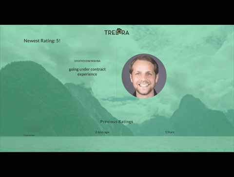
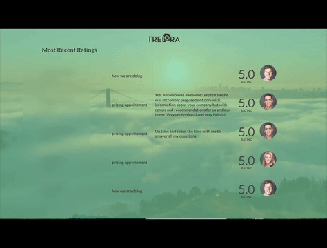
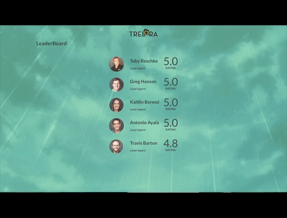
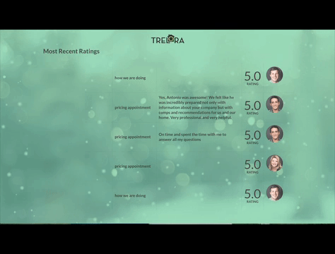

# Trelora LeaderBoard

The personal project is the final pair project in Module 3 at Turing. It's a Rails and React application that displays internal transaction data, customer feedback, and the agent leaderboard on office TV screens.

[Project Outline](https://github.com/turingschool/lesson_plans/blob/master/ruby_03-professional_rails_applications/self_directed_project.md)

### Instructions

* clone the project in your terminal by running `git clone git@bitbucket.org:ratingsa/ratinganimals.git`
* start the server with `rails s` and visit `http://localhost:3000` in your preferred browser
* to run the tests, run `bundle exec rake test` in the terminal

### Areas of Focus

* consume the MyTrelora internal API
* implement a production quality user interface for office TV screens
* optimize with caching, using background workers, and AJAX requests
* complete with a partner over a period of 2 weeks

### Features
* Views will cycle every 30 seconds
* Dynamic background will change based on the weather.
* 
* 
* 
* 
